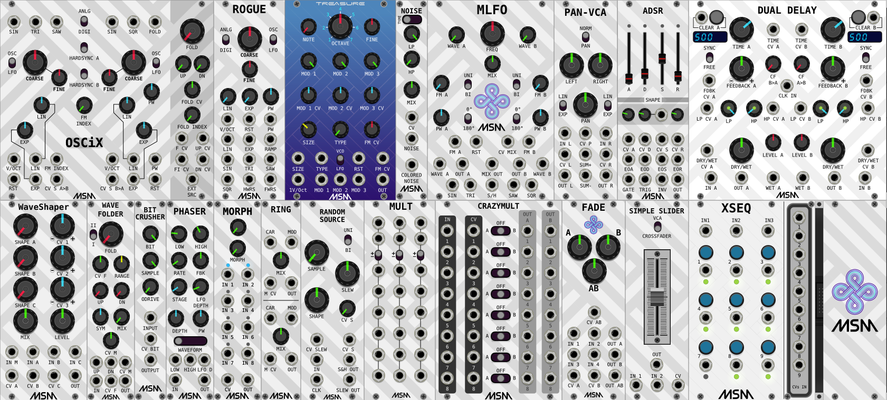
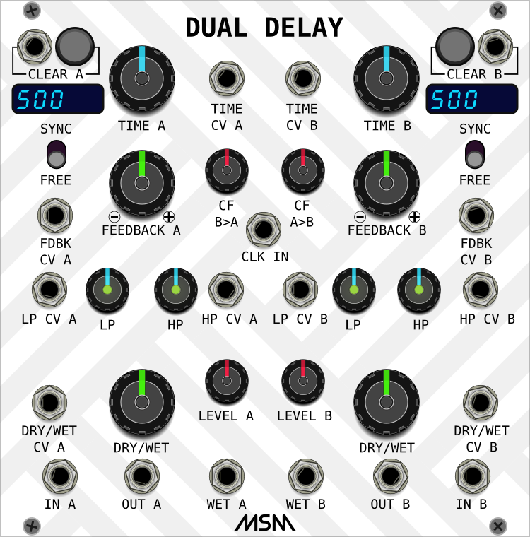
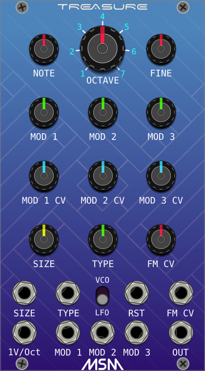
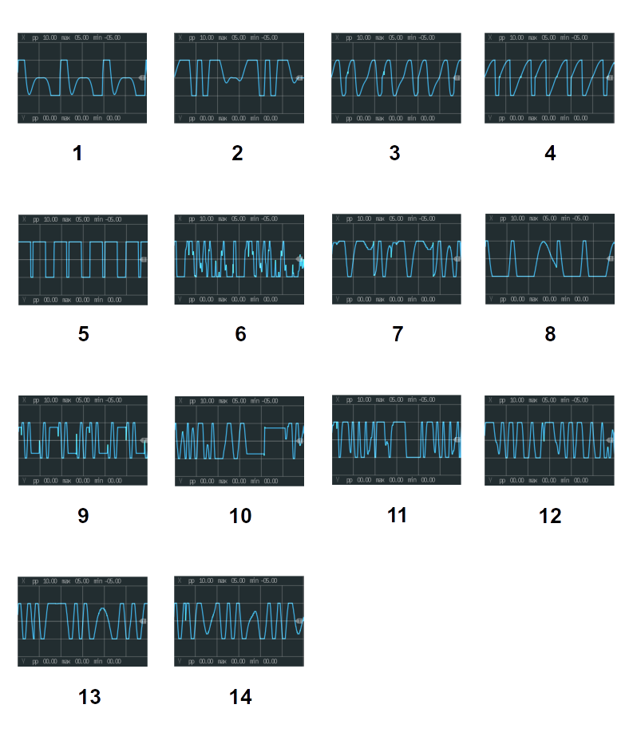
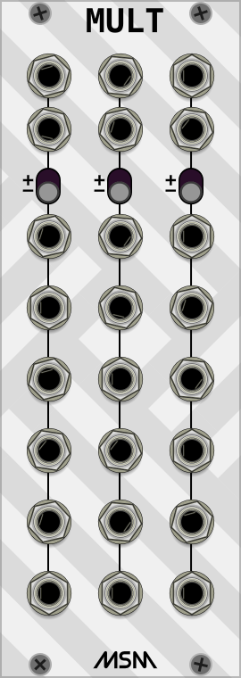
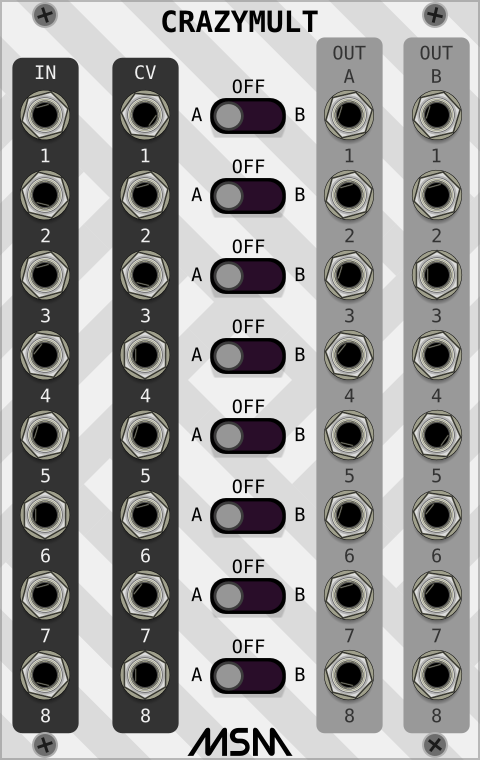
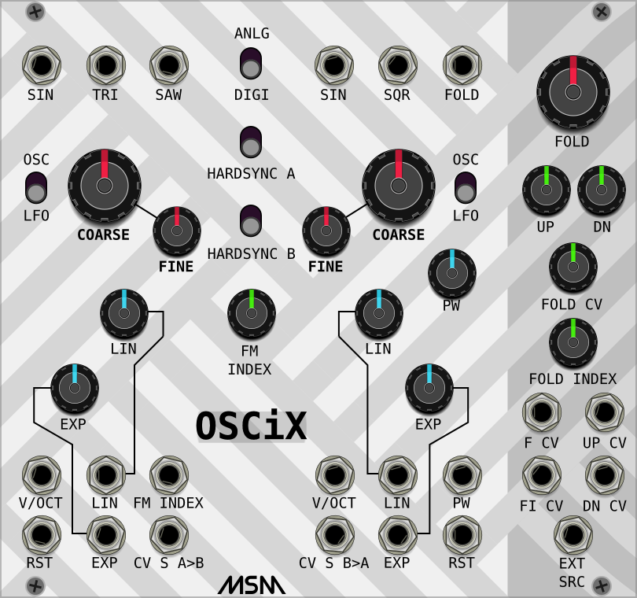
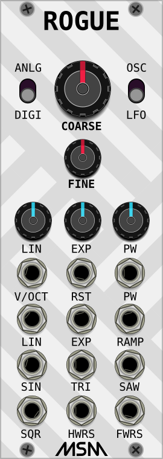
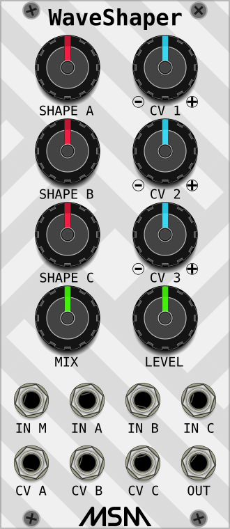
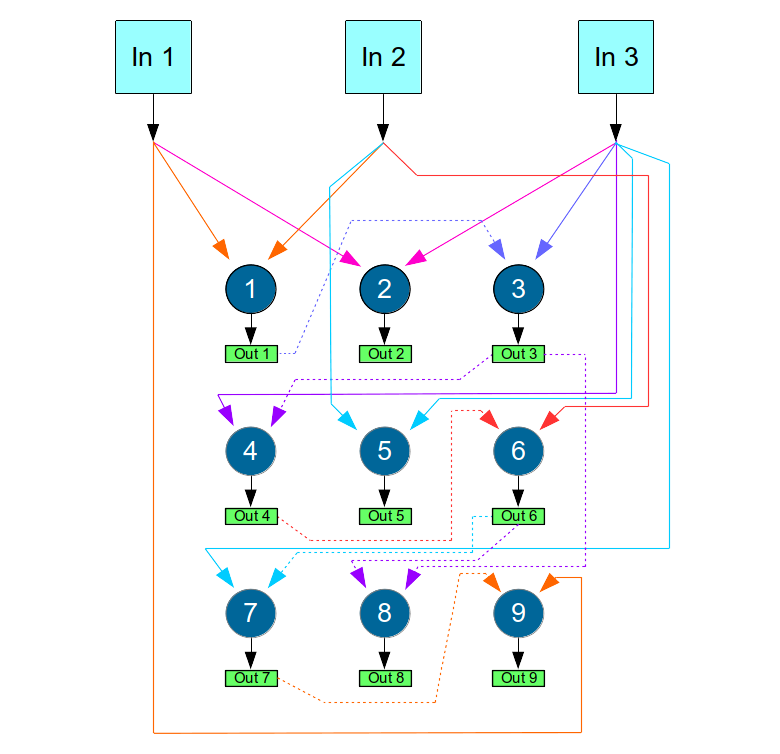

# MSM VCV Rack Modules - Version 1.X

***
This plugin contains a set of modules written by Phal-anx. Originally this plugin was closed-source, but Phal-anx kindly decided to open-source the project. The plugin has been ported to V1 and maintained by Netboy3. Please report any issues on this GitHub repo [issue tracker](https://github.com/netboy3/MSM-vcvrack-plugin/issues).

_Please note_: Unless otherwise noted, CV inputs are scaled as 0-10V and are summed with their corresponding mechanical control function/knob.

## The modules:

- [ADSR](#ADSR)
- [Bitcrusher](#Bitcrusher)
- [Dual Delay](#DualDelay)
- [Treasure VCO](#TreasureVCO)
- [Fade](#Fade)
- [MLFO](#MLFO)
- [Morph](#Morph)
- [Mult](#Mult)
- [Noise](#Noise)
- [Phaser](#Phaser)
- [Random Source](#RandomSource)
- [Ring](#Ring)
- [Simple Slider](#SimpleSlider)
- [CrazyMult](#CrazyMult)
- [PAN-VCA](#PANVCA)
- [OSCiX](#OSCiX)
- [Rogue](#Rogue)
- [Wavefolder](#Wavefolder)
- [WaveShaper](#WaveShaper)
- [XSEQ](#XSEQ)

##  **========== ADSR ==========**

This ADSR uses sliders to adjust the Attack, Decay, Sustain, and Release values. Above the sliders are LED's that provide visual indication of when the relevant section is active. The Shape knobs under the A, D and R sliders allow changing the shape or curvature of the ADR slopes. The default position is linear, and can be modified to either exponential or logarithmic. The Decay shape also has a CV input. The "CV[A/D/S/R]"" are 0-10V inputs that can be used to control the ADSR.
##  **========== Bitcrusher ==========**

This module introduces an audio effect distortion by changing the sample's bit length and the sample rate. The "BIT" and "SAMPLE" knobs allow adjusting those properties respectively. The "ODRIVE" (overdrive) knob allows amplifying the audio signal beyond the input levels. The bit length can also be controlled with the "CV BIT" input.
##  **========== Dual Delay ==========**

The Dual Delay module has two independent delay lines. Each delay line can operate in either a free running or synced mode (determined by the FREE/SYNC switch). In free running mode samples will be delayed for number of milliseconds displayed in the delay display window. Switching to synced mode requires an external clock feed in "CLK IN". The clock input will then serve as a base BPM and samples will be delayed for the measure/note length displayed. The time-delay/note/measure can be adjusted using the "TIME" knob (and "TIME CV" input). Each delay line buffer can be cleared by the "CLEAR" push button or a 10V trigger in the "CLEAR" input. The "FEEDBACK" knob (and "FDBK CV" input) control the amount of feedback brought back into the delay line from the output. Injected feedback can be in-phase (+) or out-of-phase (-). Each delay line has two integrated filters, one high-pass and one low-pass with an adjustable cutoff of 1kHz-10kHz. By default the filters are off, but can be turned on by either applying CV to their respective input or turning their knobs away from the default position (this works similar to old transistor-radio volume knobs that had their on/off switch at the beginning of their travel). A green LED on top of the knob indicates whether the filter is active. The "DRY/WET" knob (and its "DRY/WET CV" input) control the mix ratio between the pure input audio (Dry) and the delayed audio (Wet). The "LEVEL" knob controls the audio level coming into the module (both wet and dry). Each input can also be crossfed to the adjacent delay line input using the "CF" knobs. The crossfeed is injected before the dry/wet mixer.
##  **========== Treasure VCO ==========**

Treasure VCO is an experimental sound source. It has 3 "MOD" (modulation) knobs which introduce custom modulation algorithms and modify the modulation manually or through CV signals. Each Mod CV input has attenuators to control the depth of the CV inputs. The "TYPE" knob and its corresponding CV input change the base type waveform (which can be further modified by the MOD knobs). Here are the base waveforms for each TYPE setting:

The "SIZE" knob and its CV modify the interpolation complexity between 512 and 2048 points. Expect a more complex pattern when increasing the SIZE value. Oscillator frequency is controlled by the "OCTAVE" and "NOTE" knobs and can be further de-tuned using the "FINE" knob. Frequency can also be controlled by the 1V/Oct CV and the "FM CV" input. The oscillator can operate as either a VCO or LFO using the "VCO/LFO" switch. In LFO mode, the frequency is 1/100 of the VCO mode. The "RST" input causes the pattern generator to reset to the beginning of the current pattern/modulation. This is especially useful in LFO mode. _Extra credit:_ Check out the special themes in this module (right-click menu).
##  **========== Fade ==========**

Fade is a triple fader module. Fader #1 is fading between inputs "IN 1" and "IN 2" using Knob "A" to "OUT A". Similarly, Fader #2 is fading between inputs "IN 3" and "IN 4" using Knob "B" to "OUT B". Fader #3 is fading between "OUT A" and "OUT B" using knob "AB" to "OUT AB". Each of the fade knobs have a corresponding CV input. All inputs and outputs are DC-coupled and can be used to apply fading effects to both audo and control signals.
##  **========== MLFO ==========**

MLFO is a low frequency oscillator that produces cyclical control voltages. Five waveforms are available: sine, triangle, sawtooth, square, and a random staircase. The random staircase is generated by a sample & hold, driven by the square wave that is sampling an internal noise source. The unique feature in this LFO is that the "WAVE" knob (and "WAVE" CV input) is morphing between each waveform, allowing generation of interesting complex waveforms. There are two independent oscillators in the module. Each is generating its own morphing output in its respective "OUT". Both are controlled by a single calibrated "FREQ" (frequency) knob. Each oscillator can further be frequency tuned (or modulated) by driving its corresponding "FM" input and adjusting the "FM" knob for depth. The "PW" knobs adjust the pulse-width of the square wave in both the dedicated output of the B oscillator and the morph outputs. The LFO has 5 dedicated outputs "SIN" (sine), "TRI" (triangle), "S/H" (random staircase), "SAW" (sawtooth) and "SQR" (square - with adjustable pulse-width using "PW B"). Each oscillator has a "UNI/BI" offset switch and a "0/180" phase shift switch. The "MIX" knob allows for even more complex morphing by crossfeeding the two oscillators outputs into the "MIX OUT". A "RST" input resets the outputs to the beginning of the current pattern.
##  **========== Morph ==========**

Morph is a variable input morpher. Adjust the number of active morphed inputs with the top knob from 2 to 8 inputs. When an input is part of the morphing cycle, its LED is on. To morph across the selected inputs use the "MORPH" knob or the CV input. The morphed signal is output at the "OUT".
##  **========== Mult ==========**

MULT is a utility module with three independent sections. Each section has two inputs (the top jacks) that are either added or subtracted from each other using the "+/-" switch and split to six outputs (bottom six jacks). This allows audio or CV signals to be sent to several destinations at once.
##  **========== Noise ==========**

This is a noise generator module. The "TYPE" switch selects between white, pink and brown and appears at the "NOISE" output. The module also includes a custom colored noise output "COLORED NOISE" that is a result of passing white noise through low-pass (adjustable cutoff 10kHz-50kHz) and high-pass (adjustable cutoff 500Hz-2.5kHz) variable filters. The "MIX" knob adjusts the amount of white noise that will pass through the filters (filters depth). The CV input controls the noise amplitude at both outputs.
##  **========== Phaser ==========**

This module implements a 2-20 stage phaser distortion effect. Number of stages can be selected between 2 to 20 using the "STAGE" knob. The All-Pass filter range is adjusted with the "LOW" and "HIGH" knobs or the corresponding CV inputs. The depth of the effect is adjusted using the "DEPTH" knob. The "FBK" knob controls the feedback level around the All-Pass network creating higher peeks in the filter response and a more dramatic effect. The network is modulated using an internal LFO that creates a sweeping effect. The LFO frequency is adjusted with the "RATE", and the modulation level is set with "LFO DEPTH" or the "LFO D" CV. The LFO can modulate using 4 waveform shapes: sine, triangle, sawtooth and square by selecting it with the "WAVEFORM" selector. When in square waveform modulation mode (rightmost), the modulating square wave can be pulse-width adjusted with the "PW" knob.
##  **========== Random Source ==========**

Random Source produces staircase waveforms. The signal present at the sample input "IN" is fed through an attenuator controlled by the "SAMPLE" knob (or the "CV S" input) is sampled at a rate set by the clock at the trigger input "CLK", and held at the voltage at the sample and hold output "S&H OUT". The exact shape of the staircase depends on the sort of waveform at the sample input.Noise and Random signals produce random patterns, LFO produces rising or falling staircase patterns. The "SLEW OUT" provides an amplitude slew version of the staircase output. Slew shape and magnitude can be adjusted with the "SHAPE" and "SLEW" knobs.
##  **========== Ring ==========**

Ring is a dual ring modulator. Carrier is introduced at the "CAR" input and modulating signal provided at the "MOD" input. The modulated result is available at the "OUT". Modulation level can be controlled with the "MIX" control or "M CV" input.
##  **========== Simple Slider ==========**

Simple Slider is a dual input VCA/Crossfader slider. The mode switch VCA/CROSSFADER determines the slider functionality. In VCA mode, "IN 1" and "IN 2" signals are equally mixed, then attenuated based on the slider position (or CV input). In CROSSFADER mode, the slider (or CV) will crossfade the input signals to the output, where "IN 1" is full when the slider is at the bottom and "IN 2" is full when the slider is at the top.
##  **========== CrazyMult ==========**

This is an 8 way dual output signal router. Each section has an input signal at "IN" and based on the position of the "A-OFF-B" switch will be routed to either "A", "B" outputs, or silenced (OFF position). Each switch can also be controlled with a CV.
##  **========== PAN-VCA ==========**

PAN-VCA is a stereo VCA/PAN combination. Mode of operation is determined by the "NORM/PAN" switch. In normal mode, the module operates as dual VCA, where "LEFT" attenuator controls the "IN L" signal level fed to the "OUT L", and similarly for the "_R" IN/OUT. In PAN mode, again, the "IN" L/R signals are attenuated by their corresponding LEFT/RIGHT controls, but they are then mixed together and fed to the PAN control that pans the mixed result across the "OUT" L/R. Panning can also be controlled by CV in the "CV P" input. The left/right attenuators can also be controlled by CV using the "CV L" and "CV R" respectively. The attenuators CV response can be set to be either linear or exponential using their LIN/EXP (those do not effect the knobs, just the CV inputs). The Sum and difference of the "IN L" and "IN R" inputs (after the attenuation) is available at the "SUM+" and "SUM-" outputs.
##  **========== OSCiX ==========**

OSCiX is an advanced dual oscillator/LFO. Some of the highlights include:
 - Multiple wave output formats (hint: there are more wave types than meets the eye! search for the easteregg)
 - Dual VCO/LFO
 - Built in wave folder
 - Advanced FM modulation including cross-modulation between oscillators
 - Analog output emulation
 - Start-Of-Cycle synchronization to either external source or the adjacent oscillator

### _Wave Formats_
The top row provides 5 fixed wave outputs. "SIN" (sine), "TRI" (triangle), "SAW" (sawtooth) generated by the left oscillator, "SIN" (sine) and "SQR" (square) generated by the right oscillator [search for the easteregg for more wave types!!!]. The square wave output pulse-width can be adjusted by the "PW" knob. The oscillator can emulate an analog signal source ("ANLG/DIGI" on ANLG). Analog emulation generates signals with richer harmonics and a random frequency slew.
### _VCO/LFO_
Each oscillator can be used as either VCO or LFO by switching it using the "VCO/LFO" switches. Frequency can be adjusted by the "COARSE" calibrated knob, and by applying CV at the 1v/Oct input. De-tunning can be done by adjusting the "FINE" control.
### _Wave Folding_
By default the folded wave comes from the sine output of the right side oscillator. Other signal sources can be fed to the folder through the "EXT SRC" input. The signal is fed to an attenuator controlled by the "FOLD INDEX" knob or the "FI CV" input. Fold shape is controlled by either the "FOLD" knob, or the "F CV" input (that input goes through the attenuator "FOLD CV" before reaching the folder). Asymmetric folding can be controlled by the folding-"UP" and folding-"DN" controls and their corresponding "UP CV" and "DN CV" inputs.
### _FM Modulation_
Each oscillator has two FM inputs. One controlled by a linear attenuator "LIN", and the other controlled by an exponential attenuator "EXP". All FM inputs then go through a global attenuator "FM INDEX" before being applied to their oscillators. Both inputs can modulate at the same time. If a signal source is not connected to the "LIN" or "EXP" inputs, its corresponding attenuator will be connected internally to the sine source of the adjacent oscillator. This allows for frequency modulation between the oscillators with no external sources.
### _Synchronization_
Each oscillator has a "RST" input that will cause its wave generators to return to their start-of-cycle when it receives a trigger. The oscillators can also trigger each other by using the "HARDSYNC A/B" switches or their corresponding "CV S A>B/B>A" inputs. When "HARDSYNC A" is switched on (or "CV S A>B" is active), the sine source of oscillator B (right side) will be used to reset the cycle of A. The cycle reset occurs on the rising zero crossing of oscillator B sine source. Similarly this works with "HARDSYNC B" where oscillator A will now reset B.
##  **========== Rogue ==========**

Rogue is OSCiX's little brother. While it uses the same oscillator it provides additional waveform outputs: "SIN" - Sine, "TRI" - Triangle, "SAW" - Sawtooth, "RAMP" - Ramp, "SQR" - Square Wave, "HWRS" - Half Wave Rectified Sine, "FWRS" - Full Wave Rectified Sine. Like OSCiX, Rogue can also be used as an LFO. The "RAMP" output will provide sawtooth wave with a different curvature in analog mode, and a reverse sawtooth in digital mode. For all other functionality please refer to the OSCiX section above.
##  **========== Wavefolder ==========**

Signal source for folding is fed to the folder through the "IN" input. The signal is fed to an attenuator controlled by the "MIX" knob or the "CV M" input (that input goes through the attenuator "CV M" before reaching the folder). Fold shape is controlled by the "FOLD" knob and the "CV F" input (that input goes through the attenuator "CV F" before reaching the folder). Asymmetric folding can be controlled by the folding-"UP" and folding-"DN" controls and their corresponding "UP" and "DN" CV inputs. The folder uses two different folding algorithms that can be selected using the "I/II" switch. Folding symmetry can be adjusted with the "SYM" knob.
##  **========== WaveShaper ==========**

The waveshaper module applies different folding algorithms to create interesting sound effects. The master input "IN M" is mixed with each one of the other inputs and then fed into the shaper engine (such as "IN M" is mixed with "IN A" and then fed to SHAPE A engine). Each one of the 3 shaper engines applies distortion based on its "SHAPE A/B/C" knob and its "CV A/B/C". The CV inputs are also attenuated (and optionally inverted) using the "CV 1/2/3" controls. The 3 shaper engine outputs are then mixed together and fed to the "OUT" through the "LEVEL" attenuator and a dry/wet "MIX" knob.
##  **========== XSEQ ==========**

The XSEQ is a sequencer based on boolean logic. It has 3 clock/LFO inputs "IN 1/2/3" (works best with a square wave). Depending on the different speeds of the clock(s)/LFO(s) at the inputs, it will produce rhythmic gates on some or all 9 outputs "1/2/3/4/5/6/7/8/9". The Logic Select buttons let you choose what kind of boolean logic is applied on each one of the outputs. There are 9 CV inputs arranged in the right column to control the Logic Select buttons electronically. Such a sequencer lands well in creating Drum rhythms etc. Following are the logic diagrams and logic flow of XSEQ.

## Credits
Special thanks go to:
- Phal-anx (Michael Struggl)
- Andrew Belt
- Alfredo Santamaria
- Dominique Camus
- Patrick Lindenberg
- Antonio Tuzzi

Original Beta-Testers:
- Espen Storø
- Omri Cohen
- Don Turnock
- Omar Brown
- Artem Leonov

## License
Project licensing information is available in [LICENSE.txt](./LICENSE.txt) 
3rd party licensing information is available in [LICENSE-dist.md](./LICENSE-dist.md)
